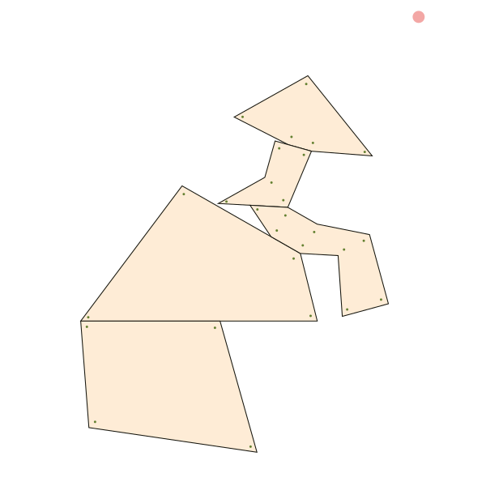
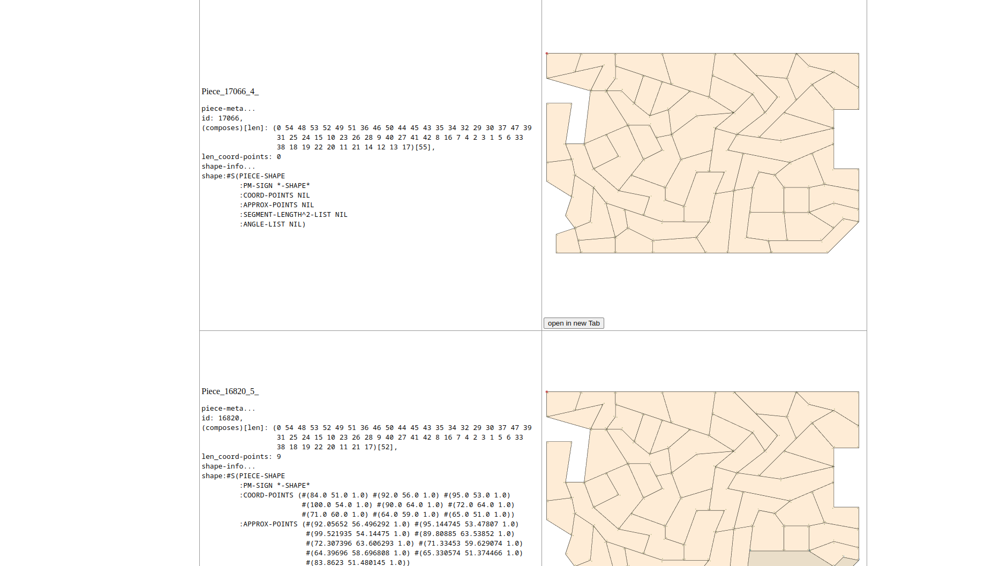

<center>



Afraid to say, He is the 木組主之示申(ki kumu nushi no kami, or, ki kumun shi no kami),  
is sitting downs to synthesized stones, is thinkingh how to solve puzzle into zero point.

<!--
```lisp
> ;; at the commit of 2fbb752, and spent the times day and night.
> (write-piece-list-as-html
              (list (nth 42
                         (all-synthesizeable-patterns-of-piece-to-piece
                          (nth 2
                               (all-synthesizeable-patterns-of-piece-to-piece
                                (nth 5 *example-problem-9*)
                                (nth 3 *example-problem-9*)))
                          (nth 49
                               (all-synthesizeable-patterns-of-piece-to-piece
                                (nth 1 *example-problem-10*)
                                (nth 1 (all-synthesizeable-patterns-of-piece-to-piece (nth 9 *example-problem-10*) (nth 8 *example-problem-10*)))))))))
```
-->

</center>

# solver of shape filling puzzle.




shape filling puzzle.


# example usage

```sh
$ # call solver program by problem number
$ ./call-puzzle-solver.ros 3 
# ... solution messages ...
$ 
$ # or call it by problem file name
$ ./procon_solve/call-puzzle-solver.ros --problem-file some/directory/problems/puzzle_XX.txt
# ... solution messages ...
$ 
```
<!--
todo: not by number, by problem file name.
-->

ref `src/note.lisp`

this is maybe older...

```lisp

CL-USER> (ql:quickload :puzzle-1617)
PUZZLE-1617> (in-package :puzzle-1617)
#<PACKAGE "PUZZLE-1617">

PUZZLE-1617> ;; in *example-problem-9*, car is frame-piece(-), cdr is noneframe-piece(+)
PUZZLE-1617> (search-solution-from-prime-pieces
              (cons (car *example-problem-9*) (cdr *example-problem-9*)))
synth-list to: 0, using-pieces [len]: (0)[1]
HTML file updated at : /path/to/projects/procon_solve/test/results/piece-list.html 
synth-list to: 1416, using-pieces [len]: (0 2)[2]
;; ...... omit ......
;; after wait, solven synthesized piece is returned.
;; access to HTML file updated, shown in above, 
;; you can look the solution and/or progresses. 
;; of the piece synthesized

PUZZLE-1617> ;; there is 7 problems prepared now. by (nth 0,1,...,6 *problem-list*), e.x.
PUZZLE-1617> (search-solution-from-prime-pieces (nth 4 *problem-list*))

PUZZLE-1617> ;; also, there is some other searching methods.
PUZZLE-1617> ;; beam search
PUZZLE-1617> (time (progn (search-solution-from-prime-pieces-beam
                           (nth 3 *problem-list*))
                          nil))

;; omit

;; and evaluation-value saved beam search 
PUZZLE-1617> ;; gradient stacked beam search
PUZZLE-1617> (time (progn (search-solution-grad-beam
                           (nth 3 *problem-list*))
                          nil))
;; omit

```

profile and tests are especially written in `src/flamegraph.lisp`, `src/profile.lisp`.
call functions defined there, you can also play artworks by this package.


# old versions

releases are available here [Releases · i-makinori/procon_solve](https://github.com/i-makinori/procon_solve/releases/).

| version | release                                                      |
|---------|--------------------------------------------------------------|
| 2017    | https://github.com/i-makinori/procon_solve/tree/release_2017 |
| 2016    | https://github.com/i-makinori/procon_solve/tree/release_2016 |


# ToDo

I'm going to do...

- [ ] コマンド引数の整理
- [ ] ドキュメント整備


# known bugs


# thankfulls 

- solver of shape filling puzzle (puzzle-1617) is the retry of the question asked at these tournaments, the NICT programming contest 2016 and 2017.  
  [第27回鳥羽大会(2016)](https://www.procon.gr.jp/?page_id=59141),  
  [第28回大島大会(2017)](https://www.procon.gr.jp/?page_id=59121)  

- problems under `test/problems/` are generated by below program.  
  [nnct-jo-ken/procon2017_kyogi_problem_maker: 2017競技_問題作成](https://github.com/nnct-jo-ken/procon2017_kyogi_problem_maker/)


## Thankfull References

Thank you for these texts books.

- calculator, linear algebra  
  [Wolfram|Alpha](https://www.wolframalpha.com/),  
  [Matrix calculator](https://matrixcalc.org/)  
- inner/outer detection for domains  
  [【第2回】点の多角形に対する内外判定｜【技業LOG】技術者が紹介するNTTPCのテクノロジー｜【公式】NTTPC](https://www.nttpc.co.jp/technology/number_algorithm.html)
- searching methods  
  [世界四連覇AIエンジニアがゼロから教えるゲーム木探索入門 #AI - Qiita](https://qiita.com/thun-c/items/058743a25c37c87b8aa4),  
  [貪欲法をビームサーチ化する際にやってはいけないこと #AI - Qiita](https://qiita.com/thun-c/items/15c4b73d288098a6e6cd)  


## Thankfull Libraries

Thank you for these libraries.

- Document Template Engine  
  [alpha123/cl-template](https://github.com/alpha123/cl-template/)
- SVG Viewer for HTML pages  
  [bumbu/svg-pan-zoom](https://github.com/bumbu/svg-pan-zoom)
- profiler, flamegraph  
  [40ants/cl-flamegraph](https://github.com/40ants/cl-flamegraph) (common lisp implement),  
  [speedscope](https://www.speedscope.app/) (web viewer of flamegraph)  
- execution script for Common Lisp  
  [roswell/](https://github.com/roswell/roswell)

Thank you!
